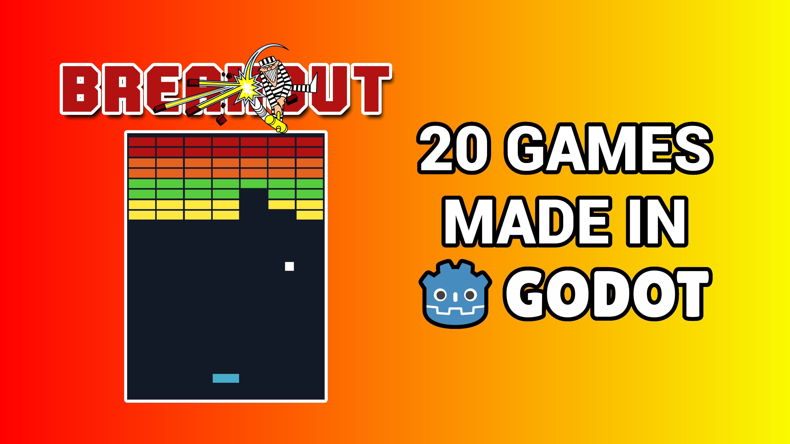
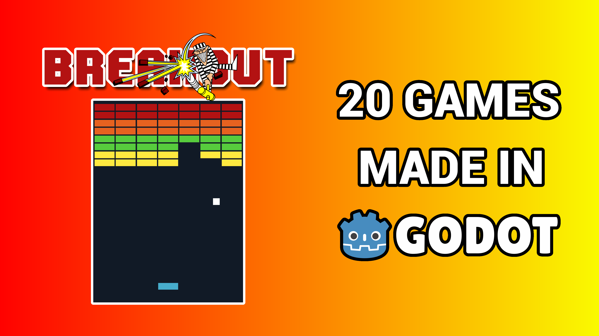

# 1. Packaging

## Title

### Ideas

- `How I made Breakout in Godot`
- `I made Breakout in Godot`
- `Making Breakout in Godot`
- `Learning Godot by making Breakout`
- `Make your first game: Breakout`
- `How to make Breakout in Godot`
- `Recreate Breakout`
- `Recreating Breakout`
- `Recreating Breakout in Godot`

### Final 4

- `How I made Breakout in Godot`
- `I made Breakout in Godot`
- `Making Breakout in Godot`

## Thumbnail

### Ideas

- ...

[Tool to get existing YouTube video thumbnails](https://www.get-youtube-thumbnail.com/)

### Final 4

## Test T&T Combination

[Use the website below to test thumbnail and title combinations](https://thumbsup.tv/)
